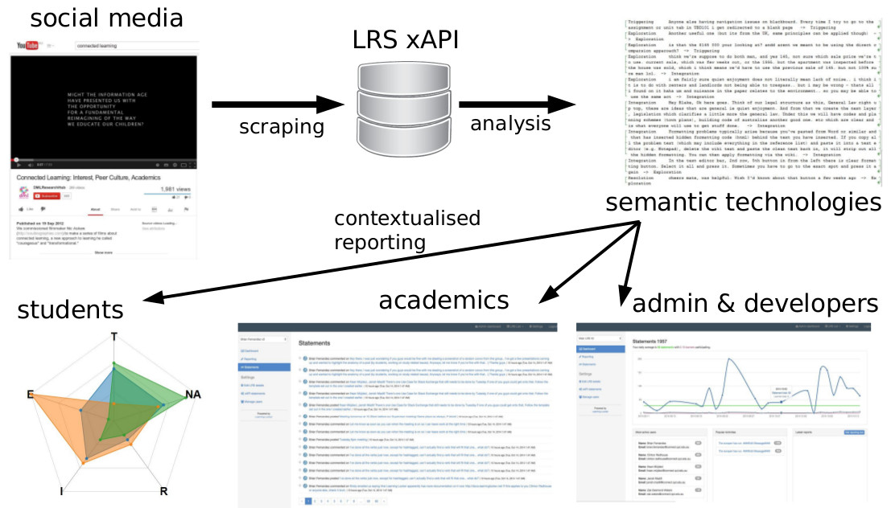



 
	<a href="http://connectedlearning.tv/infographicv">Connected Learning</a> is a modern pedagogical approach holding that knowledge and learning is distributed across a social, conceptual network. It holds that when people forge, negotiate and nurture connections for themselves (between people, information, knowledge, ideas and concepts), learning is more powerful and sustainable.

	The CLA toolkit helps students and teachers to harvest data about their activities in standard social media environments, and then provide immediate feedback and reports. It is currently in development, but the basic design is sketched out below:	   
	

 
	The CLA toolkit relies heavily upon the <a href="http://www.adlnet.gov/tla/experience-api/">Experience API (xAPI)</a>, which makes it possible to capture student behaviour in a highly flexible manner and send it to a Learning Record Store (LRS) for immediate or later analysis. We currently have tools in development that will interface with the API's of 
	<ul>
		<li>Google+</li>
		<li>Twitter</li>
		<li>StackExchange</li>
		<li>Google Docs</li>	     
		<li>Facebook</li>
		<li>RSS feeds (i.e. blogs)</li>
	</ul>
	Some details can be found in this paper: 
	<ul>
		<li> K. Kitto, S. Cross, Z. Waters & M. Lupton. <a href="http://dl.acm.org/citation.cfm?id=2723627">Learning Analytics beyond the LMS: the Connected Learning Analytics Toolkit</a>.  In Proceedings of the Fifth International Conference on Learning Analytics And Knowledge (LAK '15).  ACM, New York, NY, USA, 11-15. (See the free eprint <a href="http://eprints.qut.edu.au/81343/">here</a>.)
		</ul>
		but things are moving fast so please <a href="mailto:CLAtoolkitemail">contact us</a> if you would like to get involved. 
	

	And if you want to go and check out the source code, then it is available on <a href="https://github.com/kirstykitto/CLAtoolkit">GitHub</a>, along with our in process <a href="https://github.com/kirstykitto/CLRecipe">Connected Learning Recipe</a>.
	

		This project has been funded by the Australian Government's Office for Learning and Teaching (OLT). The Proposal that we submitted can be found <a href="assets/papers/prop.id.qut.kitto.2014-front.pdf">here</a>.	